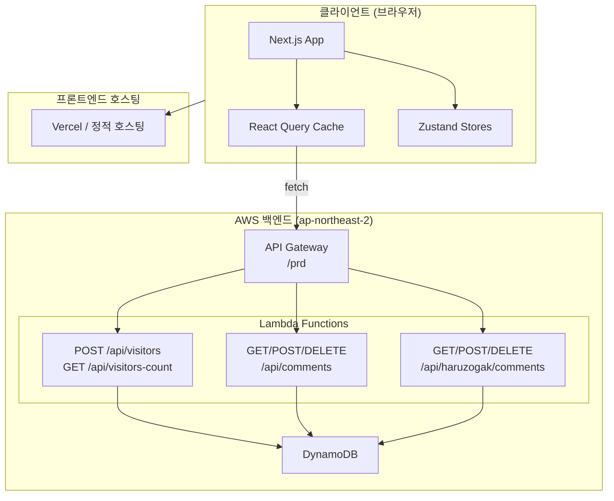
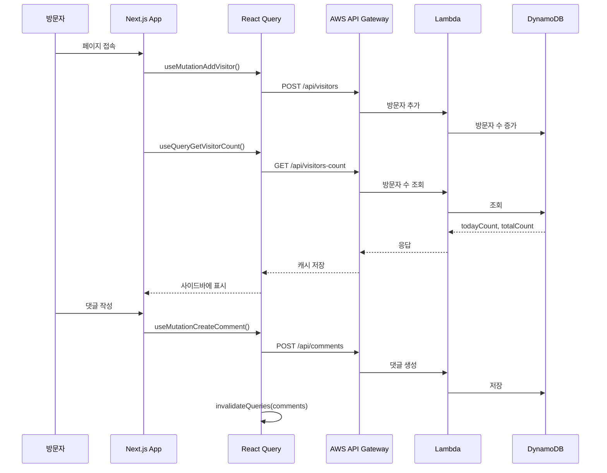

# 시스템 아키텍처

## 시스템 개요

Next.js 15 App Router 기반의 클라이언트 사이드 렌더링(CSR) 중심 포트폴리오 웹사이트. 프론트엔드는 Vercel 또는 유사 플랫폼에 배포되며, 백엔드는 AWS API Gateway + Lambda + DynamoDB 서버리스 아키텍처로 구성.

## 아키텍처 다이어그램

## 컴포넌트 설명

### Next.js App (`src/app/`)
- **목적**: 전체 애플리케이션의 라우팅 및 레이아웃 관리
- **책임**: 페이지 라우팅, 글로벌 레이아웃, 메타데이터, Provider 설정
- **의존성**: React, Next.js, TanStack Query, Zustand
- **타입**: Application

### API 레이어 (`src/apis/`)
- **목적**: 백엔드 API와의 통신 추상화
- **책임**: HTTP 요청, React Query 훅 제공, 캐시 관리
- **의존성**: TanStack React Query, fetch API
- **타입**: Client

### 상태 관리 (`src/stores/`)
- **목적**: 클라이언트 사이드 UI 상태 관리
- **책임**: 헤더 표시/숨김 상태, 섹션 스크롤 참조 관리
- **의존성**: Zustand
- **타입**: Shared

### UI 컴포넌트 (`src/styles/components/ui/`)
- **목적**: shadcn/ui 기반 재사용 가능한 UI 프리미티브
- **책임**: Button, Input, Dialog, Popover, Sidebar 등 기본 UI 요소
- **의존성**: Radix UI, Tailwind CSS, CVA
- **타입**: Shared

## 데이터 흐름

## 통합 포인트

- **외부 API**: AWS API Gateway (`lamn50rx46.execute-api.ap-northeast-2.amazonaws.com/prd`)
  - 댓글 CRUD, 방문자 카운팅
- **데이터베이스**: AWS DynamoDB (백엔드에서 관리, 프론트엔드에서 직접 접근 불가)
- **서드파티 서비스**: 없음 (순수 AWS 서버리스 백엔드)

## 인프라 컴포넌트

- **CDK 스택**: 없음 (프론트엔드 전용 레포지토리)
- **배포 모델**: 정적 사이트 배포 (Vercel 추정, `next build` + `next-sitemap`)
- **네트워킹**: HTTPS 통신, CORS 설정은 API Gateway 측에서 관리
