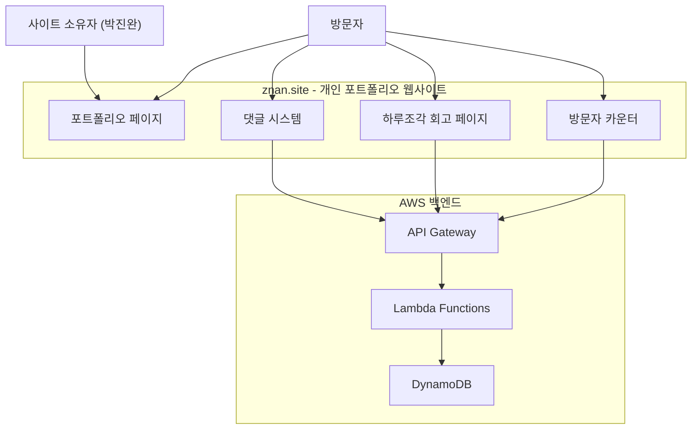

# 비즈니스 개요

## 비즈니스 컨텍스트 다이어그램

## 비즈니스 설명

- **비즈니스 설명**: 풀스택 개발자 박진완(ZNAN)의 개인 포트폴리오 웹사이트. 자기소개, 경력, 프로젝트 소개, 시스템 디자인 시각화, 방문자 댓글 기능을 제공하는 단일 페이지 애플리케이션.
- **비즈니스 트랜잭션**:
  1. **포트폴리오 열람**: 방문자가 소개, 경력, 프로젝트 정보를 열람
  2. **댓글 작성**: 방문자가 닉네임/비밀번호와 함께 댓글 등록 (비밀댓글 옵션 포함)
  3. **댓글 삭제**: 작성자가 비밀번호 인증 후 댓글 삭제
  4. **하루조각 회고 댓글**: 하루조각 서비스 관련 별도 댓글 시스템
  5. **방문자 카운팅**: 페이지 접속 시 자동으로 방문자 수 기록 및 표시
- **비즈니스 사전**:
  - **ZNAN**: 사이트 소유자의 닉네임/브랜드명
  - **하루조각**: 과거 LG CNS 재직 시 개발했던 마이데이터 서비스명
  - **비밀댓글**: 사이트 소유자만 확인 가능한 비공개 댓글
  - **System Design**: 각 프로젝트의 인프라/아키텍처 시각화 섹션

## 컴포넌트별 비즈니스 설명

### Portfolio 페이지 (`src/app/(portfolio)/`)
- **목적**: 개발자 소개, 경력, 프로젝트를 시각적으로 보여주는 메인 랜딩 페이지
- **책임**: Intro(자기소개), Ask Me(Q&A), Experience(경력 타임라인), Projects(프로젝트 쇼케이스 + 시스템 디자인)

### Comment 시스템 (`src/app/comment/`)
- **목적**: 방문자가 사이트 소유자에게 메시지를 남길 수 있는 방명록 기능
- **책임**: 댓글 CRUD, 비밀댓글 처리, 비밀번호 기반 삭제 인증

### 하루조각 회고 (`src/app/comment/haruzogak/`)
- **목적**: 하루조각 서비스 종료 후 관련자들이 회고 댓글을 남기는 전용 페이지
- **책임**: 하루조각 전용 댓글 CRUD, 별도 OG 메타데이터 관리

### API 레이어 (`src/apis/`)
- **목적**: AWS 백엔드와의 통신을 담당하는 클라이언트 사이드 API 훅
- **책임**: React Query 기반 데이터 페칭, 캐시 무효화, 에러 처리
