# 의존성

## 내부 의존성

```mermaid
flowchart TD
    Layout["layout.tsx"]
    Portfolio["(portfolio)/page.tsx"]
    Comment["comment/page.tsx"]
    Haruzogak["comment/haruzogak/page.tsx"]
    
    Layout --> MainHeader
    Layout --> MainSidebar
    Layout --> MainLayoutWrapper
    Layout --> TanQueryProviders
    
    MainLayoutWrapper --> useHideHeaderOnScroll
    MainLayoutWrapper --> useMutationAddVisitor
    
    MainHeader --> useHeaderStore
    MainHeader --> useSectionStore
    MainHeader --> DarkModeToggle
    
    MainSidebar --> useQueryGetVisitorCount
    MainSidebar --> useSectionStore
    
    Portfolio --> IntroSection
    Portfolio --> AskMeSection
    Portfolio --> ExperienceSection
    Portfolio --> ProjectSection
    
    Comment --> useQueryGetComments
    Comment --> CommentForm
    Comment --> CommentList
    
    Haruzogak --> ClientView
    ClientView --> useQueryGetHaruzogakComments
    ClientView --> CommentHaruzogakForm
    ClientView --> CommentHaruzogakList
    
    CommentForm --> useMutationCreateComment
    CommentHaruzogakForm --> useMutationCreateHaruzogakComment
    CommentList --> CommentDeletePopover
    CommentHaruzogakList --> CommentDeleteHaruzogakPopover
    CommentDeletePopover --> useMutationDeleteComment
    CommentDeleteHaruzogakPopover --> useMutationDeleteHaruzogakComment
    
    useHideHeaderOnScroll --> useHeaderStore
    
    IntroSection --> useSectionStore
    AskMeSection --> useSectionStore
```

### 주요 의존 관계

#### layout.tsx → 공통 컴포넌트
- **타입**: Runtime
- **이유**: 전체 앱 레이아웃 구성 (Header, Sidebar, Provider)

#### API 훅 → React Query + Constants
- **타입**: Runtime
- **이유**: 모든 API 훅이 BASE_API_URL과 React Query에 의존

#### 댓글 컴포넌트 → API 훅
- **타입**: Runtime
- **이유**: 댓글 CRUD 기능 수행

#### 포트폴리오 섹션 → Zustand Store
- **타입**: Runtime
- **이유**: 섹션 간 스크롤 네비게이션을 위한 ref 공유

## 외부 의존성

### next (15.4.1)
- **목적**: React 프레임워크, SSR/SSG, 라우팅
- **라이선스**: MIT

### react / react-dom (19.1.0)
- **목적**: UI 렌더링
- **라이선스**: MIT

### @tanstack/react-query (5.83.0)
- **목적**: 서버 상태 관리, API 캐싱
- **라이선스**: MIT

### zustand (5.0.6)
- **목적**: 경량 클라이언트 상태 관리
- **라이선스**: MIT

### zod (4.0.5)
- **목적**: 런타임 타입 검증
- **라이선스**: MIT

### react-hook-form (7.60.0)
- **목적**: 폼 상태 관리
- **라이선스**: MIT

### @radix-ui/* (다수)
- **목적**: 접근성 기반 UI 프리미티브
- **라이선스**: MIT

### tailwindcss (4.1.11)
- **목적**: 유틸리티 퍼스트 CSS
- **라이선스**: MIT

### lucide-react (0.525.0)
- **목적**: 아이콘
- **라이선스**: ISC

### sonner (2.0.6)
- **목적**: 토스트 알림
- **라이선스**: MIT

### class-variance-authority (0.7.1)
- **목적**: 컴포넌트 변형 관리
- **라이선스**: Apache-2.0

### clsx (2.1.1) / tailwind-merge (3.3.1)
- **목적**: 클래스명 유틸리티
- **라이선스**: MIT
